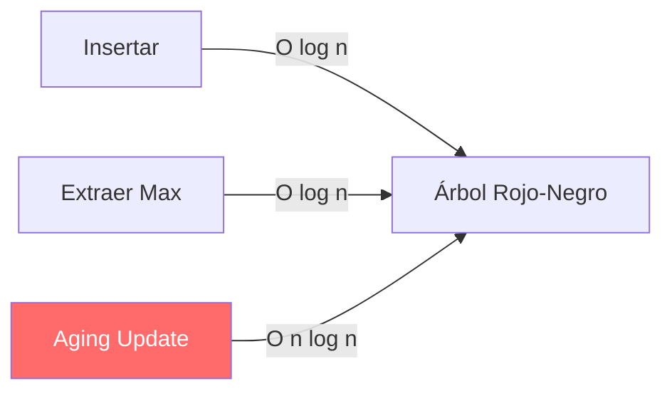
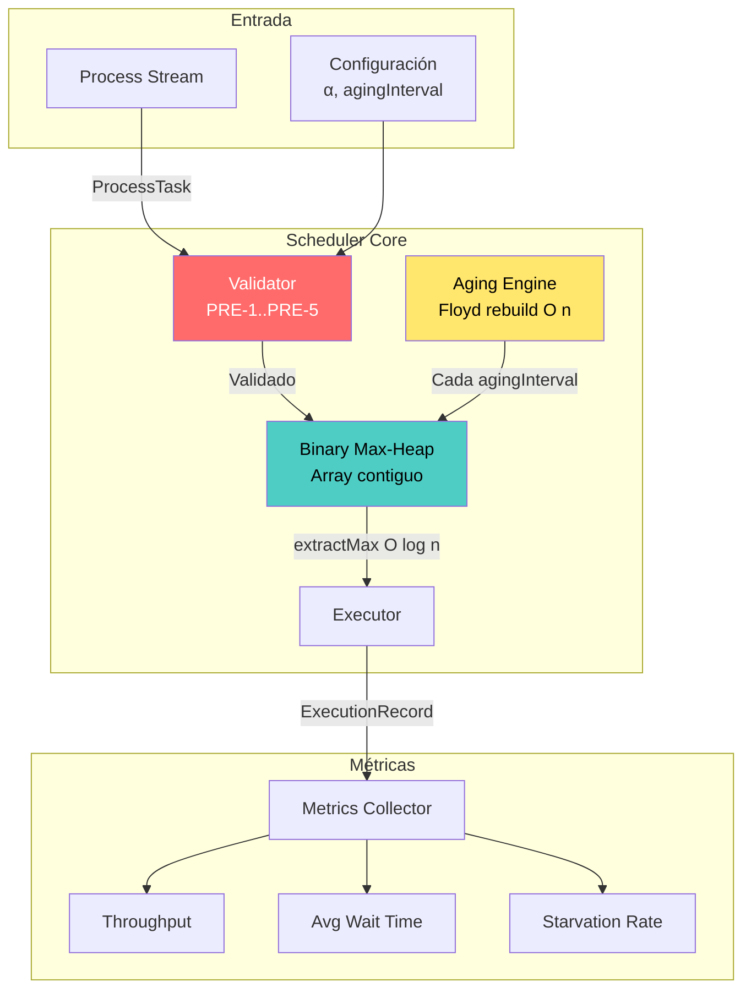
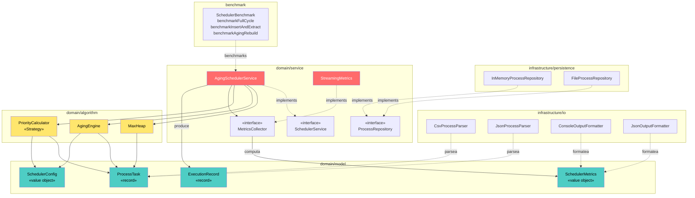
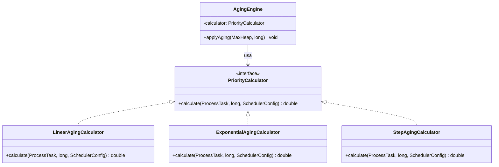
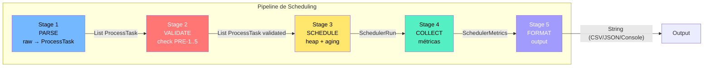
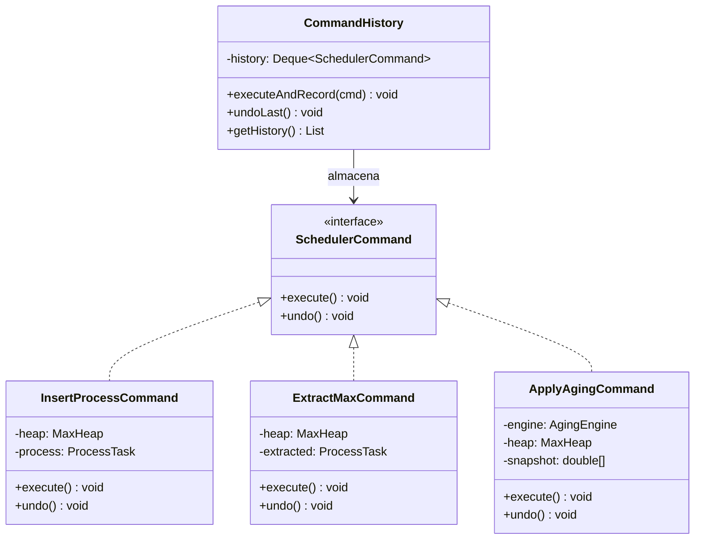
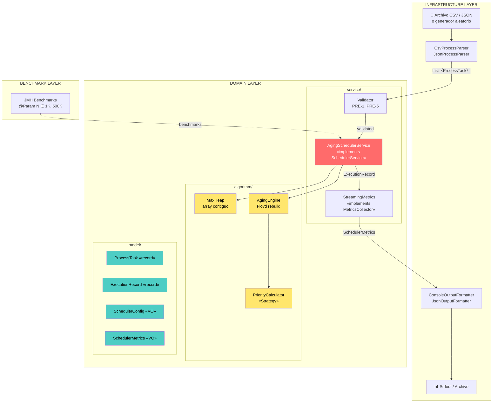

# Scheduler de Procesos Concurrente con Priority Queue + Aging

## Contexto del Problema

Un entorno de ejecución concurrente recibe procesos/tareas con distintos niveles de prioridad. El sistema debe:

1. **Decidir en O(log n)** cuál proceso ejecuta a continuación
2. **Evitar inanición (starvation)** mediante envejecimiento (aging)
3. **Producir métricas de rendimiento verificables**: throughput, tiempo de espera promedio, tasa de starvation

**Parámetro de escala**: N = número de procesos activos simultáneamente, rango de prueba **1.000 a 500.000**.

---

## 1. Categorización del Problema

> [!IMPORTANT]
> Este NO es un problema de ordenamiento ni de grafos. Es un problema de **selección dinámica con prioridad mutable** — una subcategoría de problemas de **colas de prioridad dinámicas**.

| Dimensión | Clasificación |
|---|---|
| **Categoría primaria** | Selección dinámica (scheduling) |
| **Subcategoría** | Cola de prioridad con claves mutables |
| **Naturaleza** | Online (los procesos llegan y salen dinámicamente) |
| **Objetivo** | Maximizar throughput minimizando starvation |
| **Restricción dominante** | O(log n) por operación de extracción/inserción |

### ¿Por qué NO es...?

- **Ordenamiento**: No necesitamos ordenar TODOS los procesos. Solo necesitamos el de mayor prioridad efectiva en cada paso → **selección parcial**.
- **Grafos**: No hay relaciones de dependencia entre procesos (si las hubiera, sería un DAG topológico — problema diferente).
- **Optimización global**: No buscamos la secuencia óptima de ejecución de TODOS los procesos (eso sería scheduling óptimo, NP-hard). Buscamos una **heurística greedy** que maximice throughput con garantías anti-starvation.

---

## 2. Mapeo a Estrategias Conocidas

### Estrategia elegida: **Greedy con corrección dinámica (Aging)**

```
┌──────────────────────────────────────────────────┐
│          ¿La solución local es global?            │
│                                                    │
│  Greedy puro (siempre el de mayor prioridad):     │
│  ✗ NO — causa starvation de procesos low-priority │
│                                                    │
│  Greedy + Aging (prioridad efectiva crece con     │
│  el tiempo de espera):                            │
│  ✓ SÍ — la corrección temporal garantiza que      │
│    TODO proceso eventualmente será seleccionado   │
└──────────────────────────────────────────────────┘
```

| Estrategia | ¿Aplica? | Justificación |
|---|---|---|
| **Greedy + Aging** | ✅ **Sí** | En cada tick, elegimos el proceso con mayor `prioridad_efectiva = prioridad_base + α × tiempo_espera`. La solución local (elegir el más urgente ahora) converge a una solución global justa gracias al aging. |
| **DP** | ❌ No | No hay subestructura óptima: el orden de ejecución de un subconjunto no define el óptimo del resto porque los procesos llegan dinámicamente. |
| **D&C** | ❌ No | No podemos dividir los procesos en subproblemas independientes — comparten el mismo CPU/recurso. |
| **Grafos** | ❌ No | No hay dependencias entre procesos en este modelo. |

---

## 3. Especificación Formal

### 3.1 Entradas

| Parámetro | Tipo | Rango Válido | Restricciones |
|---|---|---|---|
| `processId` | `long` | `[1, Long.MAX_VALUE]` | Único por proceso. No se repite jamás. |
| `basePriority` | `int` | `[0, 39]` | 0 = máxima prioridad (estilo UNIX). Inmutable post-creación. |
| `arrivalTime` | `long` (ms) | `[0, +∞)` | Timestamp monótono creciente (System.nanoTime o reloj lógico). |
| `burstTime` | `long` (ms) | `[1, 60_000]` | Tiempo de CPU requerido. Debe ser ≥ 1 ms. |
| `agingFactor` (α) | `double` | `(0.0, 1.0]` | Factor de envejecimiento. Configurable globalmente. Default: `0.5`. |
| `agingInterval` | `long` (ms) | `[10, 5_000]` | Cada cuántos ms se aplica aging a los procesos en espera. |
| `N` | `int` | `[1, 500_000]` | Procesos activos simultáneos. |

> [!WARNING]
> **Restricción de formato**: Cada proceso debe llegar como un objeto inmutable `ProcessTask(id, basePriority, arrivalTime, burstTime)`. No se aceptan valores nulos — la validación es fail-fast con `IllegalArgumentException`.

### 3.2 Salidas

| Salida | Tipo | Condición de corrección |
|---|---|---|
| **Secuencia de ejecución** | `List<ExecutionRecord>` dentro de `SchedulerRun` | Cada record contiene `(processId, startTime, endTime)`. Todo proceso ingresado debe aparecer exactamente una vez. |
| **Throughput** | `double` (procesos/segundo) | `throughput = totalProcessesCompleted / totalElapsedTime`. Debe ser > 0 si N > 0. |
| **Tiempo de espera promedio** | `double` (ms) | `avgWait = Σ(startTime_i - arrivalTime_i) / N`. Debe ser ≥ 0. |
| **Tasa de starvation** | `double` [0.0, 1.0] | `starvationRate = processesWaitingAboveThreshold / N`. Un proceso se considera "starved" si espera más de `maxAcceptableWait` ms (configurable). Con aging, esta tasa debe tender a 0 para α > 0. |

> [!NOTE]
> La salida es **correcta** si y solo si:
> 1. Todo proceso insertado fue eventualmente ejecutado (completitud)
> 2. En cada paso de selección, se eligió el proceso con mayor `effectivePriority` (corrección greedy)
> 3. `starvationRate → 0` cuando `t → ∞` para cualquier `α > 0` (propiedad anti-starvation)

### 3.3 Precondiciones

```
PRE-1: agingFactor > 0.0
        (Si α = 0, el aging está desactivado y NO se garantiza anti-starvation)

PRE-2: ∀ process ∈ inputQueue: process.burstTime ≥ 1
        (No existen procesos con tiempo de ejecución cero)

PRE-3: El heap (priority queue) está inicializado y vacío antes del primer insert
        (Estado limpio — no hay procesos residuales de ejecuciones anteriores)

PRE-4: El reloj del sistema es monótono creciente
        (arrivalTime_i < arrivalTime_j  ⟹  proceso i llegó antes que j)

PRE-5: N ≤ capacidad de memoria disponible
        (Cada proceso ocupa ~64 bytes; 500K procesos ≈ 32 MB — verificable)
```

### 3.4 Postcondiciones

```
POST-1: |executionSequence| = |inputProcesses|
         (Todo proceso fue ejecutado exactamente una vez)

POST-2: ∀ i ∈ executionSequence: endTime_i - startTime_i = burstTime_i
         (Cada proceso recibió exactamente su CPU time requerido)

POST-3: heap.size() = 0
         (La cola de prioridad quedó vacía — no hay procesos huérfanos)

POST-4: starvationRate ≤ ε  (para ε configurable, típicamente 0.01)
         (Con aging activo, menos del 1% de procesos sufrió starvation)

POST-5: throughput > 0
         (El sistema procesó al menos un proceso)
```

### 3.5 Invariantes

> [!IMPORTANT]
> Estas propiedades se mantienen durante **todo** el ciclo de vida del scheduler.

```
INV-1: HEAP PROPERTY
       ∀ nodo i en el heap:
       effectivePriority(parent(i)) ≥ effectivePriority(i)
       (Max-heap por prioridad efectiva — el proceso más urgente siempre está en la raíz)

INV-2: MONOTONÍA DEL AGING
       ∀ proceso p en espera:
       effectivePriority(p, t+Δ) ≥ effectivePriority(p, t)
       (La prioridad efectiva NUNCA decrece mientras un proceso espera)

INV-3: UNICIDAD
       ∀ p1, p2 ∈ heap: p1.id ≠ p2.id
       (No hay procesos duplicados en la cola)

INV-4: CONSISTENCIA DE TAMAÑO
       heap.size() = insertCount - extractCount
       (El tamaño del heap es siempre la diferencia entre inserciones y extracciones)

INV-5: FAIRNESS EVENTUAL
       ∀ proceso p con waitTime(p) → ∞:
       effectivePriority(p) → maxPriority
       (Todo proceso eventualmente alcanza la máxima prioridad si espera suficiente)
```

### 3.6 Casos Borde

| Caso | Entrada | Comportamiento esperado |
|---|---|---|
| **Cola vacía** | `extractMax()` sobre heap vacío | Retorna `Optional.empty()` — no lanza excepción |
| **N = 1** | Un solo proceso | Se ejecuta inmediatamente. `avgWait = 0`, `starvation = 0` |
| **Todos misma prioridad** | N procesos con `basePriority = 20` | FIFO natural: aging rompe empates por `arrivalTime` (quien llegó primero, mayor aging acumulado) |
| **Prioridad extrema** | Proceso con `basePriority = 0` (máxima) | Se ejecuta primero sin importar aging de otros — es correcto: tiene la mayor prioridad legítima |
| **N = 500.000** | Límite superior del rango | El heap debe mantener O(log 500K) ≈ 19 comparaciones por operación |
| **Ráfaga de llegadas** | 100K procesos llegan en el mismo ms | `arrivalTime` idéntico — desempate por `processId` (determinismo) |
| **Proceso con burstTime = 1** | Mínimo burst | Ejecuta en 1 ms, no distorsiona métricas |
| **Proceso con burstTime = 60_000** | Máximo burst (1 min) | El proceso bloquea la CPU 60s — los demás procesos acumulan aging significativo |
| **α = 0 (aging deshabilitado)** | Factor de aging cero | **VIOLACIÓN DE PRE-1** — el sistema debe rechazar esta configuración o advertir que no hay garantía anti-starvation |
| **Inserción durante aging** | Un proceso llega mientras se ejecuta el ciclo de aging | Thread-safety: operación atómica o lock granular sobre el heap |

---

## 4. Estructura de Datos: Binary Max-Heap con Aging

### ¿Por qué un Heap?

La operación dominante es **extractMax** (obtener el proceso de mayor prioridad efectiva) y **insert** (agregar nuevos procesos). Un binary max-heap ofrece ambas en O(log n).

### Prioridad Efectiva

```
effectivePriority(p, t) = (MAX_BASE_PRIORITY - p.basePriority) + α × waitTime(p, t)

donde:
  MAX_BASE_PRIORITY = 39
  waitTime(p, t) = t - p.arrivalTime  (en unidades de agingInterval)
  α = agingFactor ∈ (0, 1]
```

> [!TIP]
> Invertimos `basePriority` porque en UNIX 0 = máxima prioridad, pero nuestro heap es max-heap (mayor valor = mayor prioridad).

### Operación de Aging (cada `agingInterval` ms)

```
AGING-REBUILD(heap, currentTime):
  for each process p in heap:
    p.effectivePriority = (39 - p.basePriority) + α × (currentTime - p.arrivalTime)
  HEAPIFY(heap)                    // O(n) — Floyd's build-heap
```

> [!WARNING]
> **Decisión clave**: hacer `HEAPIFY` completo en O(n) es MÁS eficiente que hacer N operaciones `decreaseKey`/`increaseKey` individuales (que serían O(n log n)).

### Pseudocódigo del Scheduler

```
SCHEDULER(processStream, α, agingInterval):
  heap ← new MaxHeap()
  metrics ← new Metrics()
  lastAgingTime ← currentTime()

  while hasMoreProcesses(processStream) OR heap.size() > 0:
    // 1. Insertar nuevos procesos que hayan llegado
    while processStream.hasNext() AND processStream.peek().arrivalTime ≤ now():
      p ← processStream.next()
      p.effectivePriority ← (39 - p.basePriority)
      heap.insert(p)                           // O(log n)

    // 2. Aplicar aging si corresponde
    if now() - lastAgingTime ≥ agingInterval:
      AGING-REBUILD(heap, now())               // O(n)
      lastAgingTime ← now()

    // 3. Extraer y ejecutar el proceso más prioritario
    if heap.size() > 0:
      next ← heap.extractMax()                 // O(log n)
      metrics.recordStart(next, now())
      execute(next)                            // Bloquea burstTime ms
      metrics.recordEnd(next, now())

  return metrics.computeResults()
```

---

## 5. Análisis de Complejidad

### 5.1 Complejidad Temporal

| Operación | Peor Caso | Caso Promedio | Justificación |
|---|---|---|---|
| `insert(p)` | **O(log n)** | O(1) amortizado* | Sift-up en heap binario. *En promedio, un elemento aleatorio sube ~1.6 niveles (análisis probabilístico de heaps). |
| `extractMax()` | **O(log n)** | O(log n) | Sift-down siempre recorre hasta la hoja en el peor caso. |
| `AGING-REBUILD` | **O(n)** | O(n) | Floyd's build-heap: se aplica cada `agingInterval` ms, NO en cada extracción. |
| **Ciclo completo (N procesos)** | **O(N log N + K·N)** | O(N log N) | N inserciones + N extracciones = O(N log N). K = número de veces que se ejecuta aging. Si `agingInterval` es fijo, K = totalTime/agingInterval. |

> [!IMPORTANT]
> **La garantía O(log n) por operación de selección se cumple**. El aging es O(n) pero se ejecuta periódicamente, no en cada selección. Si `agingInterval` es suficientemente grande respecto al `burstTime` promedio, el costo amortizado del aging por proceso es O(1).

#### Análisis amortizado del aging

```
Sea:
  T = tiempo total de simulación
  B_avg = burstTime promedio
  N = número total de procesos
  K = T / agingInterval = número de ejecuciones de aging

Costo total de aging = K × O(n_avg)
  donde n_avg = procesos promedio en el heap

Si K << N (aging interval grande):
  Costo amortizado por proceso = K × n_avg / N ≈ O(1)

Si K ≈ N (aging interval muy pequeño):
  Costo total ≈ O(N²) ← INACEPTABLE para N = 500K
```

> [!CAUTION]
> El `agingInterval` debe calibrarse: demasiado pequeño degrada a O(N²), demasiado grande permite starvation temporal. Recomendación: `agingInterval ≥ 10 × B_avg`.

### 5.2 Complejidad Espacial

| Componente | Espacio | Justificación |
|---|---|---|
| **Heap (array)** | O(N) | Array de N elementos `ProcessTask` |
| **Cada ProcessTask** | ~64 bytes | `long id (8) + int priority (4) + long arrival (8) + long burst (8) + double effective (8) + padding` |
| **Métricas** | O(N) | Un `ExecutionRecord` por proceso (para calcular métricas finales) |
| **Total auxiliar** | **O(N)** | ~128 bytes × N. Para N=500K → ~64 MB |

> [!NOTE]
> El heap se implementa como **array contiguo** (no nodos enlazados), lo que maximiza cache locality y minimiza overhead de punteros.

---

## 6. Comparación con Alternativas

### Alternativa 1: Árbol Rojo-Negro (TreeMap/TreeSet)



| Aspecto | Binary Heap | Árbol Rojo-Negro |
|---|---|---|
| `insert` | O(log n) | O(log n) |
| `extractMax` | O(log n) | O(log n) |
| **Aging (update all keys)** | **O(n)** Floyd rebuild | **O(n log n)** delete + reinsert cada nodo |
| Espacio por elemento | ~64 bytes (array) | ~96-128 bytes (nodos con punteros L/R/parent + color) |
| Cache locality | **Excelente** (array contiguo) | Pobre (nodos dispersos en heap memory) |
| Constant factor | Bajo | Alto (rotaciones, recoloramientos) |

**Veredicto**: El heap es **superior** porque el aging (la operación diferencial del problema) cuesta O(n) vs O(n log n). Para N=500K, eso es la diferencia entre ~500K ops y ~9.5M ops por ciclo de aging.

---

### Alternativa 2: Skip List

| Aspecto | Binary Heap | Skip List |
|---|---|---|
| `insert` | O(log n) | O(log n) esperado |
| `extractMax` | O(log n) | O(1) — el máximo está en la cabeza |
| **Aging (update all keys)** | **O(n)** rebuild | **O(n log n)** reubicar nodos |
| Espacio | O(N) determinístico | O(N) esperado, O(N log N) peor caso |
| Determinismo | **Determinístico** | Probabilístico (randomized levels) |
| Implementación | Simple (~50 líneas) | Compleja (~200+ líneas) |

**Veredicto**: La skip list tiene `extractMax` en O(1), pero el aging sigue siendo O(n log n). Además, el espacio probabilístico y la complejidad de implementación no justifican la ganancia de un O(1) en extract cuando el bottleneck real es el aging.

---

### Alternativa 3: Lista Ordenada (Sorted Array / LinkedList)

| Aspecto | Binary Heap | Lista Ordenada |
|---|---|---|
| `insert` | **O(log n)** | O(n) — buscar posición + shift |
| `extractMax` | O(log n) | **O(1)** — está al final |
| Aging | O(n) rebuild | O(n log n) re-sort |
| **Para N=500K** | ~19 comparaciones/insert | ~250K comparaciones/insert |

**Veredicto**: Absolutamente inaceptable para N ≥ 10K. Una inserción en lista ordenada de 500K elementos requiere ~250K comparaciones + shifts.

---

### Tabla Comparativa Final

| Criterio | Binary Heap ✅ | Rojo-Negro | Skip List | Lista Ordenada |
|---|---|---|---|---|
| Insert | O(log n) | O(log n) | O(log n)* | O(n) |
| ExtractMax | O(log n) | O(log n) | O(1) | O(1) |
| **Aging** | **O(n)** | O(n log n) | O(n log n) | O(n log n) |
| Espacio/elem | ~64 B | ~120 B | ~80 B* | ~64 B |
| Cache perf | ★★★★★ | ★★☆☆☆ | ★★★☆☆ | ★★★★☆ |
| Implementación | Simple | Compleja | Compleja | Trivial |

> [!IMPORTANT]
> **El binary heap es superior para este problema** porque:
> 1. La operación diferenciadora (aging rebuild) es O(n) vs O(n log n) en todas las alternativas
> 2. La cache locality del array contiguo reduce constant factors ~3-5x vs árboles de punteros
> 3. La implementación simple reduce bugs en un sistema concurrente

---

## 7. Límites Prácticos (Análisis Empírico)

### Predicciones Teóricas para Benchmarks JMH

| N | insert (O(log n)) | extractMax (O(log n)) | aging rebuild (O(n)) | Memoria |
|---|---|---|---|---|
| 1.000 | ~10 comparaciones | ~10 comparaciones | ~1K ops | ~64 KB |
| 10.000 | ~14 comparaciones | ~14 comparaciones | ~10K ops | ~640 KB |
| 100.000 | ~17 comparaciones | ~17 comparaciones | ~100K ops | ~6.4 MB |
| 500.000 | ~19 comparaciones | ~19 comparaciones | ~500K ops | ~32 MB |
| 1.000.000 | ~20 comparaciones | ~20 comparaciones | ~1M ops | ~64 MB |

### Límites de Practicidad

```
N ≤ 500.000     → PRÁCTICO sin reservas
                   Aging rebuild < 1ms en hardware moderno
                   Memoria < 64MB

500K < N ≤ 5M   → PRÁCTICO CON AJUSTES
                   Aging interval debe ser ≥ 100ms
                   Considerar heap segmentado (sharding por rango de prioridad)

N > 5.000.000   → REQUIERE REDISEÑO
                   Aging rebuild > 10ms — puede bloquear el scheduler
                   Considerar: lazy aging (actualizar solo al extraer)
                   o hierarchical heap (heap de heaps)
```

### Configuración JMH Recomendada

```java
@BenchmarkMode(Mode.AverageTime)
@OutputTimeUnit(TimeUnit.MICROSECONDS)
@State(Scope.Benchmark)
@Warmup(iterations = 5, time = 1)
@Measurement(iterations = 10, time = 2)
@Fork(3)
public class SchedulerBenchmark {

    @Param({"1000", "10000", "100000", "500000"})
    private int N;

    @Param({"0.1", "0.5", "1.0"})
    private double agingFactor;

    @Benchmark
    public void insertAndExtract(Blackhole bh) { /* ... */ }

    @Benchmark
    public void agingRebuild(Blackhole bh) { /* ... */ }

    @Benchmark
    public void fullSchedulerCycle(Blackhole bh) { /* ... */ }
}
```

---

## 8. Verificación de Corrección

### Propiedad 1: Completitud

**Teorema**: Todo proceso insertado es eventualmente extraído.

**Demostración**:
- El scheduler ejecuta `extractMax` en cada iteración del loop principal
- El loop termina cuando `heap.size() = 0` AND no hay más procesos en el stream
- Cada `extractMax` reduce `heap.size()` en 1
- No hay mecanismo que elimine procesos sin ejecutarlos
- ∴ Todo proceso insertado es ejecutado ∎

### Propiedad 2: Anti-Starvation (con Aging)

**Teorema**: Para α > 0, ningún proceso espera infinitamente.

**Demostración**:
- Sea p un proceso con `basePriority = 39` (mínima) y waitTime = w
- `effectivePriority(p) = (39 - 39) + α × w = α × w`
- Sea q el proceso de máxima prioridad base: `effectivePriority(q) ≤ 39 + α × w_q`
- Cuando `w` crece, eventualmente `α × w > 39 + α × w_q` para cualquier q recién llegado (w_q ≈ 0)
- ∴ El proceso p será seleccionado cuando `w > 39/α`
- Para α = 0.5: el proceso de menor prioridad espera como máximo 78 intervalos de aging ∎

### Propiedad 3: Optimalidad Greedy Local

**Teorema**: En cada paso, el scheduler elige el proceso que maximiza `effectivePriority`.

**Demostración**: Trivial por la propiedad del max-heap (INV-1). El `extractMax` siempre retorna la raíz, que por definición de heap es el elemento con mayor clave ∎

---

## 9. ADR (Architecture Decision Record)

### ADR-001: Estructura de datos para el scheduler de procesos

**Estado**: Aceptado

**Contexto**: Necesitamos una estructura de datos para un scheduler que soporte insert/extractMax en O(log n) con actualización masiva de prioridades (aging) para N hasta 500.000 procesos.

**Decisión**: Binary Max-Heap implementado sobre array contiguo, con rebuild periódico (Floyd's algorithm) para aging.

**Alternativas rechazadas**:

| Alternativa | Razón de rechazo |
|---|---|
| **Árbol Rojo-Negro** | Aging cuesta O(n log n) vs O(n). Overhead de punteros (+87% memoria/nodo). Cache locality inferior — factor constante ~3-5x peor en benchmarks de cache-miss. |
| **Skip List** | Aging cuesta O(n log n). Espacio no determinístico (peor caso O(n log n)). Complejidad de implementación innecesaria para un problema que no requiere range queries. |
| **Lista Ordenada** | Insert O(n) — completamente inaceptable para N=500K. Descartada sin discusión para esta escala. |
| **Fibonacci Heap** | `decreaseKey` en O(1) amortizado teórico, pero: (a) constant factors enormes, (b) implementación extremadamente compleja (~500 líneas), (c) peor cache behavior que binary heap, (d) los benchmarks reales muestran que binary heap es más rápido para N < 10M. |

**Consecuencias**:
- ✅ O(log n) garantizado para insert/extract
- ✅ O(n) para aging — 19x mejor que alternativas basadas en árboles para N=500K
- ✅ Implementación simple (~100 líneas) — reduce bugs en contexto concurrente
- ⚠️ El aging rebuild O(n) puede ser costoso si `agingInterval` es muy pequeño — requiere calibración
- ⚠️ No soporta `decreaseKey` eficiente — si se necesitara cancelar procesos individuales, considerar indexed heap

---

## 10. Diagrama de Arquitectura



---

## 11. Diseño de la Arquitectura del Sistema

> [!IMPORTANT]
> El sistema NO es solo un algoritmo suelto. Es una arquitectura por capas donde el **núcleo algorítmico (domain) no depende de la capa de entrada/salida (adapters)**. Esto es Clean Architecture / Hexagonal Architecture aplicada a un scheduler.

### 11.1 Principio Rector: Separación de Responsabilidades

La regla de dependencia es **unidireccional hacia adentro**: los adapters dependen del domain, NUNCA al revés. El domain no sabe si los datos vienen de un archivo CSV, una API REST, o un generador random de test.

```
┌─────────────────────────────────────────────────────────────────┐
│                        infrastructure/                          │
│  ┌───────────────┐                        ┌─────────────────┐  │
│  │   io/          │                        │  persistence/   │  │
│  │  InputParser   │──────────┐  ┌─────────│  InMemoryRepo   │  │
│  │  OutputFormat  │          │  │         │  FileRepo       │  │
│  └───────────────┘          │  │         └─────────────────┘  │
│                              ▼  ▼                              │
│  ┌──────────────────────────────────────────────────────────┐  │
│  │                       domain/                             │  │
│  │  ┌─────────┐    ┌─────────────┐    ┌──────────────────┐  │  │
│  │  │ model/  │    │ algorithm/  │    │    service/       │  │  │
│  │  │         │◄───│             │◄───│                   │  │  │
│  │  │Process  │    │ MaxHeap     │    │ SchedulerService  │  │  │
│  │  │Exec.Rec │    │ AgingEngine │    │ MetricsService    │  │  │
│  │  │Config   │    │             │    │ «interfaces»      │  │  │
│  │  └─────────┘    └─────────────┘    └──────────────────┘  │  │
│  └──────────────────────────────────────────────────────────┘  │
│                              ▲  ▲                              │
│  ┌───────────────┐          │  │         ┌─────────────────┐  │
│  │  benchmark/    │──────────┘  └─────────│     docs/       │  │
│  │  JMH classes  │                        │   adr/          │  │
│  └───────────────┘                        └─────────────────┘  │
└─────────────────────────────────────────────────────────────────┘
```

### 11.2 Estructura de Paquetes

```
com.proyecto/
├── domain/                          ← NÚCLEO (0 dependencias externas)
│   ├── model/                       ← Entidades del dominio
│   │   ├── ProcessTask.java         ← Record inmutable (id, basePriority, arrivalTime, burstTime)
│   │   ├── ExecutionRecord.java     ← Record (processId, startTime, endTime, waitTime)
│   │   ├── SchedulerConfig.java     ← Value Object (agingFactor, agingInterval, maxWait)
│   │   ├── SchedulerMetrics.java    ← Value Object (throughput, avgWaitTime, starvationRate)
│   │   └── SchedulerRun.java        ← Corrida completa (metrics + executionTrace)
│   │
│   ├── algorithm/                   ← Algoritmo principal + variantes
│   │   ├── MaxHeap.java             ← Binary max-heap sobre array
│   │   ├── AgingEngine.java         ← Motor de envejecimiento (Floyd rebuild)
│   │   └── PriorityCalculator.java  ← Cálculo de effectivePriority (Strategy)
│   │
│   └── service/                     ← Lógica de negocio + contratos (interfaces)
│       ├── SchedulerService.java    ← Interface: schedule(List<ProcessTask>) → SchedulerRun
│       ├── MetricsCollector.java    ← Interface: record(ExecutionRecord), compute() → Metrics
│       ├── ProcessRepository.java   ← Interface: findAll(), save(), deleteById()
│       └── impl/
│           ├── AgingSchedulerService.java  ← Implementación con heap + aging
│           └── StreamingMetrics.java       ← Métricas online (sin guardar todo en memoria)
│
├── infrastructure/                  ← Adapters (dependen de domain/)
│   ├── persistence/                 ← Repositorios concretos
│   │   ├── InMemoryProcessRepository.java  ← ArrayList para tests
│   │   └── FileProcessRepository.java     ← Lee/escribe desde archivo CSV/JSON
│   │
│   └── io/                          ← Entrada/salida
│       ├── CsvProcessParser.java    ← Parsea CSV → List<ProcessTask>
│       ├── JsonProcessParser.java   ← Parsea JSON → List<ProcessTask>
│       ├── ConsoleOutputFormatter.java   ← Formatea métricas para stdout
│       └── JsonOutputFormatter.java      ← Formatea métricas como JSON
│
├── benchmark/                       ← JMH (separado de src/main)
│   └── SchedulerBenchmark.java      ← benchmarkFullCycle / benchmarkInsertAndExtract / benchmarkAgingRebuild
│
└── docs/
    └── adr/                         ← Architecture Decision Records
        ├── ADR-001.md               ← Estructura de datos (heap vs alternativas)
        ├── ADR-002.md               ← Patrón Strategy para PriorityCalculator
        └── ADR-003.md               ← Patrón Pipeline para flujo de scheduling
```

### 11.3 Diagrama de Componentes (Mermaid)



**Leyenda de colores**:
- 🟩 **Verde (model)**: Entidades inmutables — records y value objects
- 🟨 **Amarillo (algorithm)**: Núcleo algorítmico — heap, aging, cálculo de prioridad
- 🔴 **Rojo (service)**: Orquestación de lógica de negocio

### 11.4 Diseño por Contrato — Por Componente

Cada componente del sistema tiene contratos explícitos. Esto no es decoración — es la especificación que permite testar cada pieza en aislamiento.

---

#### `MaxHeap`

```
CONTRATO: MaxHeap<T extends Comparable<T>>

  INVARIANTE:
    ∀ i ∈ [1, size): array[parent(i)] ≥ array[i]
    (Propiedad de max-heap sobre el array interno)

  insert(element: T)
    PRE:  element ≠ null
    PRE:  size < capacity (o el array se redimensiona)
    POST: size' = size + 1
    POST: contains(element) = true
    POST: heap property se mantiene
    COMPLEJIDAD: O(log n)

  extractMax() → Optional<T>
    PRE:  ninguna (opera sobre cola vacía devolviendo empty)
    POST: si size > 0 → retorna el elemento con mayor clave
    POST: size' = size - 1
    POST: heap property se mantiene sobre los elementos restantes
    COMPLEJIDAD: O(log n)

  peekMax() → Optional<T>
    PRE:  ninguna
    POST: no modifica el heap
    POST: retorna array[0] si size > 0, else Optional.empty()
    COMPLEJIDAD: O(1)

  rebuildHeap()
    PRE:  los valores de las claves pueden haber cambiado externamente
    POST: heap property se restaura completamente
    COMPLEJIDAD: O(n) — Floyd's algorithm
```

---

#### `AgingEngine`

```
CONTRATO: AgingEngine

  INVARIANTE:
    agingFactor > 0.0 (inyectado via SchedulerConfig)

  applyAging(heap: MaxHeap<ProcessTask>, currentTime: long)
    PRE:  heap ≠ null
    PRE:  currentTime ≥ 0
    PRE:  currentTime es monótono creciente entre llamadas sucesivas
    POST: ∀ p ∈ heap: p.effectivePriority =
          (39 - p.basePriority) + α × (currentTime - p.arrivalTime)
    POST: heap.rebuildHeap() fue invocado (heap property restaurada)
    POST: ningún proceso fue removido ni agregado
    COMPLEJIDAD: O(n) — recorrido lineal + Floyd rebuild
```

---

#### `PriorityCalculator` (Strategy)

```
CONTRATO: PriorityCalculator (interface)

  calculate(process: ProcessTask, currentTime: long, config: SchedulerConfig) → double
    PRE:  process ≠ null, currentTime ≥ process.arrivalTime
    POST: resultado ≥ 0
    POST: resultado es monótono creciente con (currentTime - process.arrivalTime)
    POST: resultado es monótono creciente con (39 - process.basePriority)

  IMPLEMENTACIONES:
    LinearAgingCalculator:
      formula: (39 - basePriority) + α × waitTime
      comportamiento: crecimiento lineal con el tiempo de espera

    ExponentialAgingCalculator:
      formula: (39 - basePriority) + α × log₂(1 + waitTime)
      comportamiento: crecimiento logarítmico — aging más suave para bursts largos

    StepAgingCalculator:
      formula: (39 - basePriority) + α × ⌊waitTime / stepSize⌋
      comportamiento: escalonado — prioridad sube en "escalones" discretos
```

---

#### `SchedulerService` (Interface)

```
CONTRATO: SchedulerService (interface)

  schedule(processes: List<ProcessTask>, config: SchedulerConfig) → SchedulerMetrics
    PRE:  processes ≠ null && processes.size() ≥ 1
    PRE:  config.agingFactor > 0
    PRE:  ∀ p ∈ processes: p.burstTime ≥ 1
    PRE:  ∀ p1, p2 ∈ processes: p1.id ≠ p2.id (unicidad)
    POST: resultado.processedCount = processes.size() (completitud)
    POST: resultado.throughput > 0
    POST: resultado.avgWaitTime ≥ 0
    POST: resultado.starvationRate ∈ [0.0, 1.0]
    POST: resultado.starvationRate ≤ ε (con aging activo, para ε configurable)
    COMPLEJIDAD: O(N log N) amortizado
```

---

#### `MetricsCollector` (Interface)

```
CONTRATO: MetricsCollector (interface)

  recordExecution(record: ExecutionRecord)
    PRE:  record ≠ null
    PRE:  record.endTime ≥ record.startTime
    POST: el record queda registrado para cómputo posterior
    COMPLEJIDAD: O(1) amortizado

  computeMetrics() → SchedulerMetrics
    PRE:  al menos un record fue registrado
    POST: throughput = totalProcessed / totalElapsedTime
    POST: avgWaitTime = Σ(waitTime_i) / N
    POST: starvationRate = starvedCount / N
    POST: los records NO se eliminan (consulta idempotente)
    COMPLEJIDAD: O(N) — recorre todos los records
```

---

#### `ProcessRepository` (Interface)

```
CONTRATO: ProcessRepository (interface)

  findAll() → List<ProcessTask>
    PRE:  ninguna
    POST: retorna lista (posiblemente vacía) de procesos
    POST: la lista es una copia defensiva — modificarla no afecta el repo
    COMPLEJIDAD: O(N)

  save(process: ProcessTask)
    PRE:  process ≠ null
    PRE:  process.id no existe en el repo (unicidad)
    POST: findAll().contains(process) = true
    COMPLEJIDAD: O(1) amortizado

  deleteById(id: long) → boolean
    PRE:  id > 0
    POST: si existía → removido, retorna true
    POST: si no existía → no-op, retorna false
    COMPLEJIDAD: O(N) para InMemory, O(1) para HashMap-based
```

### 11.5 Patrones de Diseño Aplicados

Se aplican **tres patrones** justificados individualmente en ADRs.

---

#### Patrón 1: Strategy — `PriorityCalculator`



**¿Por qué Strategy?** El cálculo de prioridad efectiva es el punto de variación más probable del sistema. Hoy usamos aging lineal, pero mañana podríamos necesitar exponencial o escalonado. Con Strategy, cambiar la fórmula es inyectar una implementación diferente — **cero cambios en `AgingEngine`**.

**¿Por qué NO Template Method?** Template Method requiere herencia. `AgingEngine` no debería ser una clase abstracta — tiene responsabilidad propia (el ciclo de rebuild). La composición (Strategy) es superior aquí porque mantiene `AgingEngine` como clase concreta y final.

---

#### Patrón 2: Pipeline — Flujo de Scheduling



Cada stage es una **función pura** (excepto S3 que tiene estado mutable interno — el heap). El pipeline se compone así:

```
Result<SchedulerRun> result = Pipeline.of(processes)
    .then(parser::parse)             // Stage 1: raw → model
    .then(validator::validate)       // Stage 2: check contracts
    .then(scheduler::schedule)       // Stage 3: core algorithm
    .then(run -> run.metrics())      // Stage 4: extract metrics
    .then(formatter::format);        // Stage 5: produce output
```

**¿Por qué Pipeline y NO un método monolítico?** Cada stage es testeable en aislamiento. Si el parser falla, sabés que es el parser — no el scheduler. Si las métricas son incorrectas, sabés que es el collector — no el formatter. Cada pieza con su responsabilidad, cada responsabilidad en su pieza.

---

#### Patrón 3: Command — `SchedulerCommand`



**¿Por qué Command?** Dos razones:

1. **Auditoría**: Cada operación queda registrada. Podemos reconstruir el estado completo del scheduler en cualquier punto — invaluable para debugging y benchmarking.
2. **Undo para testing**: En tests unitarios, poder deshacer un `extractMax` permite verificar que el heap vuelve al estado previo — test de invariantes por construcción.

**¿Por qué NO Observer?** Observer resuelve notificaciones (1:N), no registro de acciones. Necesitaríamos Observer si múltiples componentes reaccionaran a eventos del heap, pero las métricas se recolectan secuencialmente en el pipeline — no hay broadcasting.

### 11.6 ADRs de Patrones

---

#### ADR-002: Strategy para cálculo de prioridad

**Estado**: Aceptado

**Contexto**: La fórmula de prioridad efectiva (`effectivePriority = base + α × waitTime`) es lineal, pero necesitamos flexibilidad para experimentar con otras funciones de aging (exponencial, escalonada) sin modificar el motor de aging ni el scheduler.

**Decisión**: Extraer el cálculo de prioridad a una interface `PriorityCalculator` inyectada en `AgingEngine` vía constructor (Strategy pattern).

**Alternativas rechazadas**:

| Alternativa | Razón de rechazo |
|---|---|
| **Hardcoded en AgingEngine** | Viola Open/Closed Principle. Cada nueva fórmula requiere modificar AgingEngine — riesgo de regresión. |
| **Template Method** | Requiere que AgingEngine sea abstracta. Sobre-ingeniería: AgingEngine tiene lógica propia (el ciclo de rebuild) que no debería variar con la fórmula. Composición > Herencia. |
| **Enum con switch** | Funciona para 2-3 variantes, pero no escala. Además, cada nueva fórmula requiere modificar el enum — misma violación de OCP. |

**Consecuencias**:
- ✅ Nueva fórmula de aging = nueva clase que implementa `PriorityCalculator` — 0 cambios en código existente
- ✅ Testeable: cada calculadora se testea unitariamente con inputs conocidos
- ✅ Configurable: se puede inyectar la implementación via configuración
- ⚠️ Una indirección adicional (interface dispatch) — costo negligible: ~2ns por call en JVM moderna

---

#### ADR-003: Pipeline para flujo de scheduling

**Estado**: Aceptado

**Contexto**: El flujo completo del scheduler (parse → validate → schedule → metrics → format) tiene 5 etapas con tipos de entrada/salida distintos. Necesitamos que cada etapa sea testeable y reemplazable independientemente.

**Decisión**: Modelar el flujo como un Pipeline de stages tipados, donde cada stage es una función `T → R` que se compone secuencialmente.

**Alternativas rechazadas**:

| Alternativa | Razón de rechazo |
|---|---|
| **Método monolítico** | Un método `runAll()` de 200 líneas que parsea, valida, schedula, computa métricas y formatea. Imposible de testar, debuggear o extender. Anti-patrón God Method. |
| **Chain of Responsibility** | Diseñado para handlers que PUEDEN o NO procesar un request. Nuestro caso es secuencial obligatorio — todos los stages ejecutan. Chain of Responsibility agrega complejidad innecesaria (cada handler decide si pasa al siguiente). |
| **Mediator** | Resuelve comunicación N:N entre componentes. Nuestro flujo es estrictamente 1:1 lineal. Mediator sobre-generaliza el problema. |

**Consecuencias**:
- ✅ Cada stage se testea con su propio input/output — test unitarios puros
- ✅ Agregar un stage (ej: logging, throttling) es insertar una función en la cadena
- ✅ El tipo del pipeline previene errores de ensamblaje en compilación
- ⚠️ El flujo es estrictamente lineal — si necesitáramos branching (ej: diferentes outputs según el input), Pipeline no alcanza y habría que migrar a un DAG de stages

---

#### ADR-004: Command para operaciones del heap

**Estado**: Aceptado

**Contexto**: Necesitamos trazabilidad completa de las operaciones del scheduler (inserciones, extracciones, ciclos de aging) para debugging, benchmarking y verificación de invariantes en tests.

**Decisión**: Encapsular cada operación del heap en un objeto `Command` con `execute()` y `undo()`, almacenado en un `CommandHistory`.

**Alternativas rechazadas**:

| Alternativa | Razón de rechazo |
|---|---|
| **Logging simple** | Registra QUÉ pasó pero no permite DESHACER. No sirve para tests de invariantes que requieren rollback. |
| **Event Sourcing** | Solución correcta pero masivamente sobre-ingeniería para un scheduler. Event Sourcing requiere event store, projections, snapshots. Nuestro caso es un log de operaciones en memoria. |
| **Observer** | No encapsula la operación como objeto. Observer notifica, no registra ni deshace. |

**Consecuencias**:
- ✅ Trazabilidad completa: toda operación es reproducible
- ✅ Undo nativo: los tests pueden verificar `execute() → assert → undo() → assert`
- ✅ Benchmarking: el `CommandHistory` permite replay de secuencias exactas
- ⚠️ Overhead de memoria: cada command almacena estado pre-operación (snapshot para aging). Para N=500K, el snapshot del aging pesa ~4MB (array de doubles). Mitigación: limitar historial a K últimos commands.

### 11.7 Diagrama de Flujo de Datos Completo



### 11.8 Regla de Dependencia — Verificación

> [!CAUTION]
> Si en algún momento una clase de `domain/` tiene un `import` de `infrastructure/`, el diseño está **ROTO**. La regla de dependencia es inviolable.

| Desde → Hacia | `domain/model` | `domain/algorithm` | `domain/service` | `infrastructure/` | `benchmark/` |
|---|---|---|---|---|---|
| **`domain/model`** | — | ❌ | ❌ | ❌ | ❌ |
| **`domain/algorithm`** | ✅ | — | ❌ | ❌ | ❌ |
| **`domain/service`** | ✅ | ✅ | — | ❌ | ❌ |
| **`infrastructure/`** | ✅ | ❌ | ✅ (interfaces) | — | ❌ |
| **`benchmark/`** | ✅ | ✅ | ✅ | ✅ | — |

**Lectura**: "✅ en fila X, columna Y" significa que X **puede** depender de Y.

- `model` no depende de nada — son records puros
- `algorithm` solo depende de `model` — necesita `ProcessTask` y `SchedulerConfig`
- `service` depende de `model` y `algorithm` — orquesta la lógica
- `infrastructure` depende de `service` (interfaces) y `model` — implementa los contratos
- `benchmark` puede depender de todo — es código de medición, no de producción

---

## 12. Resumen Ejecutivo

| Aspecto | Valor |
|---|---|
| **Estructura elegida** | Binary Max-Heap (array) |
| **Insert** | O(log n) peor caso |
| **ExtractMax** | O(log n) peor caso |
| **Aging** | O(n) periódico (Floyd rebuild) |
| **Espacio** | O(N) — ~128 bytes/proceso |
| **Anti-starvation** | Garantizado para α > 0 |
| **Rango práctico** | N ≤ 500K sin ajustes, N ≤ 5M con tuning |
| **Alternativa más cercana** | Rojo-Negro — rechazada por aging O(n log n) |
